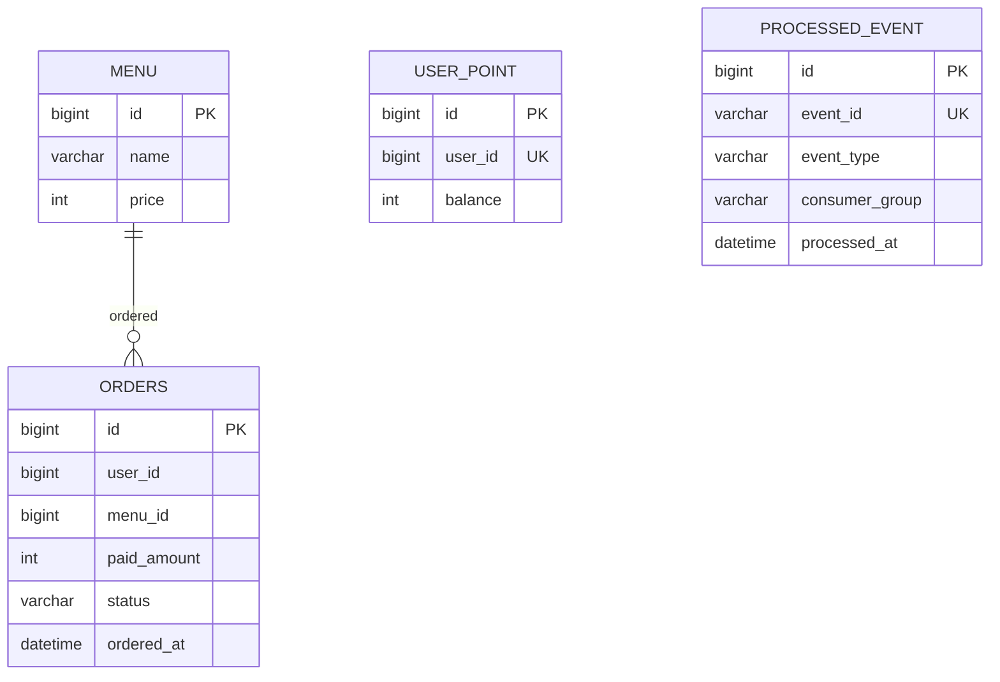

# ERD 초안

## 테이블 책임

| 테이블 | 책임 |
| --- | --- |
| `menu` | 주문 가능한 커피 메뉴와 가격의 원천 데이터입니다. |
| `user_point` | 사용자별 현재 포인트 잔액입니다. |
| `orders` | 완료된 주문 이력의 원천 데이터입니다. |
| `processed_event` | Kafka Consumer 멱등 처리를 위한 처리 완료 이벤트 기록입니다. |

## 주요 제약

- `menu.price`는 0보다 커야 합니다.
- `user_point.user_id`는 unique입니다.
- `user_point.balance`는 0 이상이어야 합니다.
- `orders.status`는 `COMPLETED`, `FAILED` 후보 중 MVP에서는 `COMPLETED` 중심으로 시작합니다.
- `processed_event.event_id`는 unique입니다.
- 재처리 대상 Consumer가 분리될 수 있으므로 `consumer_group`을 함께 기록하는 방안을 우선 검토합니다.

## 인덱스 후보

- `user_point(user_id)` unique.
- `processed_event(event_id)` unique.
- `orders(status, ordered_at)`.
- `orders(ordered_at, menu_id)`.

인덱스는 실제 쿼리 구조와 EXPLAIN 결과를 본 뒤 확정합니다.

## Flyway 초안

| 파일 | 내용 |
| --- | --- |
| `V1__create_menu.sql` | 메뉴 테이블과 seed 데이터 생성. |
| `V2__create_user_point.sql` | 포인트 테이블 생성. |
| `V3__create_orders.sql` | 주문 테이블 생성. |
| `V4__create_processed_event.sql` | 이벤트 멱등 테이블 생성. |

초기 구현에서는 JPA ddl-auto에 의존하지 않고 Flyway migration을 기준으로 DB 스키마를 고정합니다.
