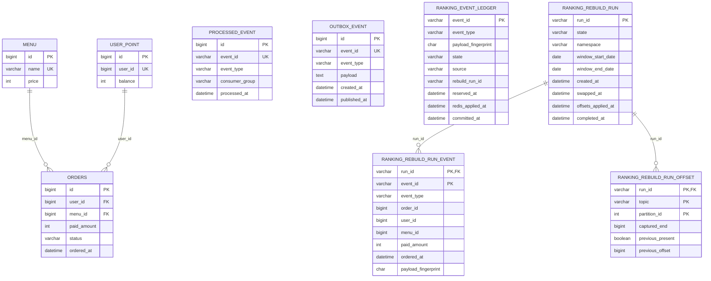

# 최종 ERD

스키마 정본은 [`V1`~`V7` Flyway migration](../../src/main/resources/db/migration)입니다.



## 테이블 책임과 관계

| 테이블 | 책임 |
| --- | --- |
| `menu` | 주문 가능한 메뉴와 가격의 원천 데이터입니다. |
| `user_point` | 사용자별 현재 포인트 잔액입니다. `orders.user_id`가 이 테이블의 unique `user_id`를 참조합니다. |
| `orders` | 결제가 끝난 주문의 원천 이력입니다. |
| `outbox_event` | 주문 트랜잭션에서 함께 저장한 Kafka 발행 대상입니다. `published_at IS NULL`인 행을 재시도합니다. |
| `processed_event` | `ranking-consumer-group`의 호환 처리 완료 이력입니다. |
| `ranking_event_ledger` | normal consumer, DLT replay, rebuild가 공유하는 랭킹 projection 원장입니다. Redis 반영 전후 상태와 payload fingerprint를 보존합니다. |
| `ranking_rebuild_run` | rebuild의 swap·offset·ledger backfill 진행 상태와 recovery 지점을 기록합니다. |
| `ranking_rebuild_run_event` | rebuild가 캡처한 이벤트와 fingerprint를 run별로 보존합니다. |
| `ranking_rebuild_run_offset` | rebuild 전후 Kafka consumer offset 복구 정보를 보존합니다. |

`outbox_event.event_id`, `processed_event.event_id`, `ranking_event_ledger.event_id`는 같은 `OrderCompletedEvent`를 추적할 수 있지만 서로 다른 실패 구간과 책임을 가집니다. 이 연결은 애플리케이션의 논리 관계이며 Flyway에는 외래 키가 없습니다. `ranking_event_ledger.rebuild_run_id`도 rebuild 출처 추적용 논리 관계이고 외래 키가 아닙니다.

```text
orders + outbox_event (한 DB 트랜잭션)
            │ event_id를 포함한 payload 발행
            ▼
processed_event (consumer 호환 이력)
            │
            └── ranking_event_ledger (Redis projection 상태·fingerprint)
                         ▲
ranking_rebuild_run ─────┘ (완료된 rebuild event만 연결)
```

## 제약과 인덱스

- `menu.price > 0`, `user_point.balance >= 0`, `orders.paid_amount > 0`입니다.
- `menu.name`, `user_point.user_id`, `processed_event.event_id`, `outbox_event.event_id`는 unique입니다.
- `orders.menu_id → menu.id`, `orders.user_id → user_point.user_id` 외래 키가 있습니다.
- `ranking_event_ledger.state`는 `RESERVED`, `REDIS_APPLIED`, `COMMITTED`; `source`는 `NORMAL_CONSUMER`, `DLT_REPLAY`, `REBUILD`; `event_type`은 `order.completed`만 허용합니다.
- `ranking_rebuild_run.state`는 `PREPARED`, `SWAPPED_PENDING_OFFSET`, `OFFSET_APPLIED_PENDING_LEDGER`, `RECOVERY_REQUIRED`, `COMPLETED`만 허용합니다.
- `ranking_rebuild_run_event.event_type`은 `chk_ranking_rebuild_run_event_type` 제약으로 `order.completed`만 허용합니다.
- `ranking_rebuild_run_event`와 `ranking_rebuild_run_offset`은 run 삭제 시 함께 삭제됩니다.
- 실제 인덱스는 `orders(status, ordered_at)`, `orders(ordered_at, menu_id)`, `outbox_event(published_at, id)`, `ranking_event_ledger(rebuild_run_id)`, `ranking_event_ledger(state, committed_at)`, `ranking_rebuild_run_event(event_id)`입니다.

## Flyway migration

| 파일 | 최종 반영 내용 |
| --- | --- |
| [`V1__create_menu.sql`](../../src/main/resources/db/migration/V1__create_menu.sql) | `menu`와 seed 4건 |
| [`V2__create_user_point.sql`](../../src/main/resources/db/migration/V2__create_user_point.sql) | `user_point` |
| [`V3__create_orders.sql`](../../src/main/resources/db/migration/V3__create_orders.sql) | `orders`, 외래 키와 조회 인덱스 |
| [`V4__create_processed_event.sql`](../../src/main/resources/db/migration/V4__create_processed_event.sql) | consumer 호환 이력 `processed_event` |
| [`V5__create_outbox_event.sql`](../../src/main/resources/db/migration/V5__create_outbox_event.sql) | Transactional Outbox와 미발행 조회 인덱스 |
| [`V6__create_ranking_event_ledger.sql`](../../src/main/resources/db/migration/V6__create_ranking_event_ledger.sql) | ranking ledger와 rebuild run/event/offset |
| [`V7__add_ranking_ledger_cleanup_index.sql`](../../src/main/resources/db/migration/V7__add_ranking_ledger_cleanup_index.sql) | bounded retention 후보 조회 인덱스 `(state, committed_at)` |

JPA `ddl-auto`로 schema를 갱신하지 않으며, migration과 실제 MySQL 검증 근거는 [Issue #114](../testing/evidence/issue-114/verification.md)와 [Issue #125](../testing/evidence/issue-125/verification.md)에 있습니다.
